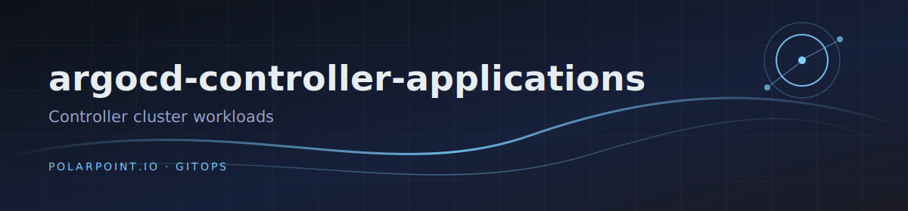

# argocd-controller-applications

Workloads for the **controller** cluster, deployed by the hub ArgoCD via
the `controller-applications` parent.

## Layout

```
releases/                  Helm chart rendered by the parent Application
  values.yaml              parent: true variant
  global-values-<env>.yaml children variant (project, destination)
  templates/               parent/children application templates
  apps/<category>/<app>/   one descriptor per app per env: <env>.yaml
```

A descriptor either points at a vendored chart (`chart.path`) or an
upstream chart (`chart.url` + `chart.targetRevision`). The children
template globs `**/<env>.yaml` and emits one Application per descriptor.

## Current apps

| Category | App | Source |
|----------|-----|--------|
| iac      | crossplane | charts.crossplane.io (v2) |
| iac      | crossplane-manifests | vendored (providers, ansible/terraform configs) |
| (root)   | controller-nginx-manifests | vendored |
